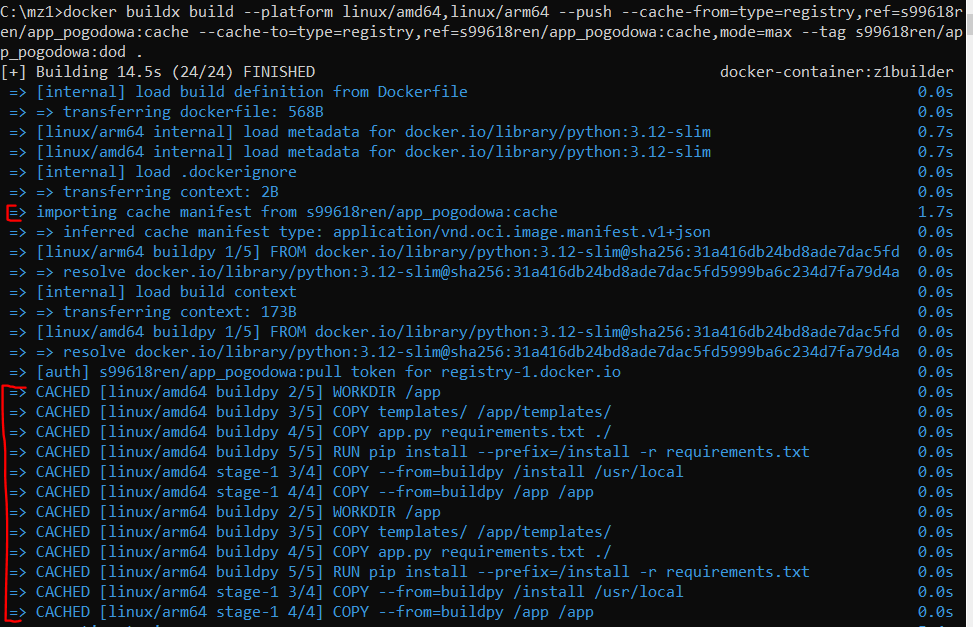
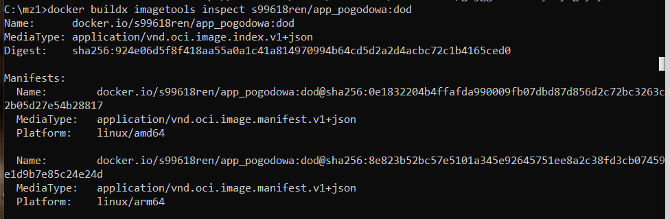
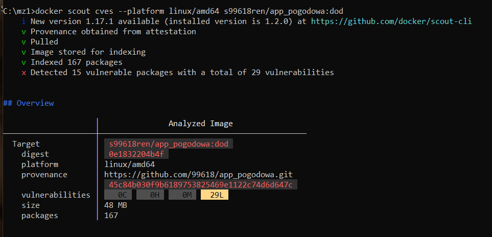

# Sprawozdanie z zadania 1, części nieobowiązkowej. 
Wykonano zadanie 2. (max. +50%)

## Polecenie do utworzenia nowego buildera opartego o docker-container
```bash
docker buildx create --name z1builder --use --bootstrap
```
## Polecenie do utworzenia obrazu kontenera dla dwóch platform sprzętowych
Pierwsza budowa aby zapisać cache we wskazanym rejestrze na DockerHub:
```bash
docker buildx build --platform linux/amd64,linux/arm64 --push --cache-to=type=registry,ref=s99618ren/app_pogodowa:cache,mode=max --tag s99618ren/app_pogodowa:dod .
```
Druga budowa korzystająca z zapisanego cache na rejestrze w DockerHub:
```bash
docker buildx build --platform linux/amd64,linux/arm64 --push --cache-from=type=registry,ref=s99618ren/app_pogodowa:cache --cache-to=type=registry,ref=s99618ren/app_pogodowa:cache,mode=max --tag s99618ren/app_pogodowa:dod .
```
## Screen potwierdzajacy wykorzystanie cache


## Potwierdzenie manifestu dla dwóch platform sprzętowych 
```bash
docker buildx imagetools inspect s99618ren/app_pogodowa:dod
```


## Wynik analizy podatności na zagrożenia
```bash
docker scout cves --platform linux/amd64 s99618ren/app_pogodowa:dod
```

