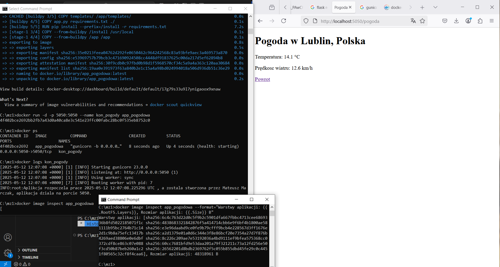

# Sprawozdanie z zadania 1, części obowiązkowej. 
Wykonano prostą aplikację pogodową w Pythonie przy pomocy frameworku Flask.

## Polecenia wykorzystane w podpunkcie 4 (polecenia Dockera)
a) docker build -t app-pogodowa .  
b) docker run -d -p 5050:5050 --name kon_pogody app_pogodowa  
c) docker logs kon_pogody  
d) docker image inspect app_pogodowa --format="Warstwy obrazu: {{.RootFS.Layers}}, Rozmiar obrazu: {{.Size}} B"

## Instrukcja uruchomienia obrazu
1. Pobranie
  ```bash
  docker pull s99618ren/app_pogodowa:latest
  ```
2. Uruchomienie kontenera
  ```bash
  docker run -p 5050:5050 s99618ren/app_pogodowa
  ```
3. Otworznie aplikacji w przeglądarce
  http://localhost:5050

## Screen potwierdzający działanie aplikcji zgodnie z wymogiem punktu 3.


## Autor - Mateusz Marczak
   
